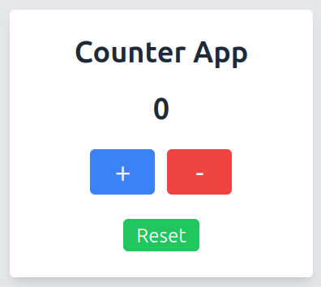
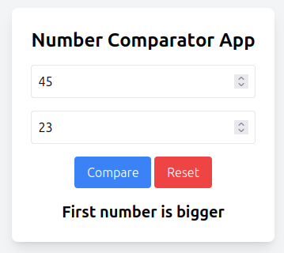
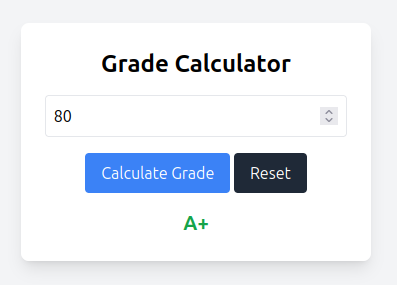
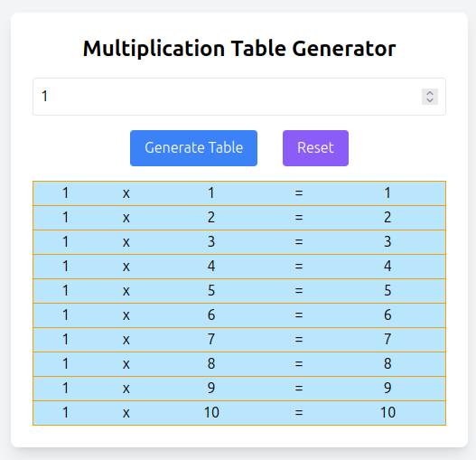
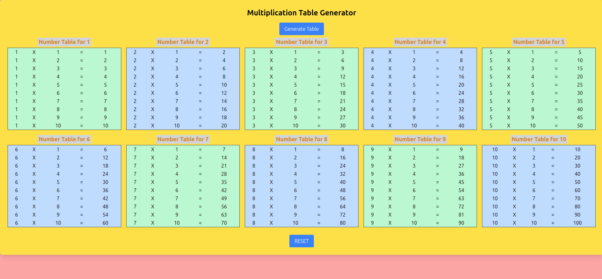
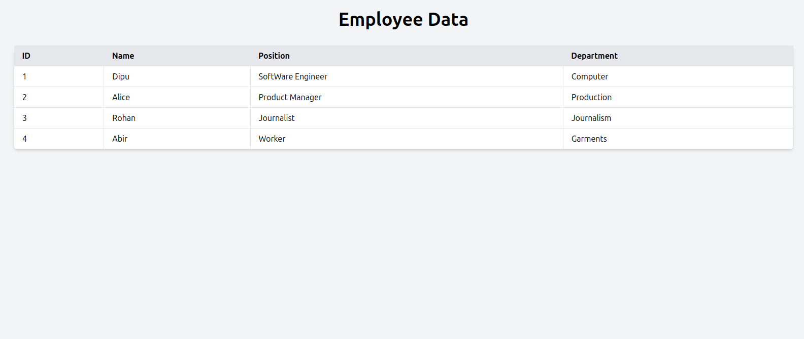
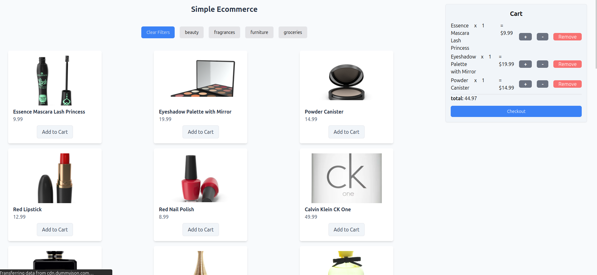
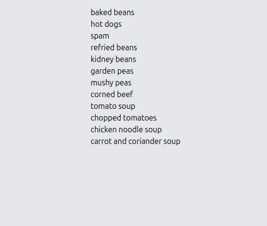

# Vanilla-JavaScript-Mastery

If you find the course helpful, ⭐ Star us on GitHub & `Follow` https://github.com/alo-kona!

🎯 Vanilla Javascript refers to using plain Javascript without relying on any libraries, frameworks or any dependencies. It runs in all browsers without requiring additional setups and builds a strong understanding of Javascript which is crucial for using frameworks effectively.

## Learning Outcome
Following this course, we are expected to be able to - 
- write statements & comments
- declare variables using `let` and `const`
- use different kinds of operators 
- use different kinds of data types
- use conditional statements & nested conditional statements
- use loops & nested loops
- define functions
- define callback functions
- define arrow functions
- understand & apply JavaScript Array Methods
- create objects
- use `this` keyword
- throw errors using `try`, `catch` statements
- understand asynchronous control flow
- understand and apply `Promise`
- understand Object Oriented Programming (OOP) concept of Javascript
- understand `DOM` & things JavaScript can do with `DOM`
- find, change, add & delete HTML Elements
- use JavaScript HTML DOM EventListener

✨ Let's learn some really fun and interactive projects to solidify our knowledge of Vanilla Javascript ✨

## <a href ="https://alo-kona.github.io/Vanilla-JavaScript-Mastery/001-counter-app/alo-kona/index.html">1. Counter App</a>
👋 In this project, we learn to count numbers from 0-10. The `+` button lets us increase the count and the `-` button lets us decrease it. We can `Reset` the count number as well! Try the app by clicking the app title!
 
### Learning outcome
 
 By building this app, we can learn to -
 - write statements using `console.log` & `alert`
 - write comments
 - define variables using `let` & `const`
 - use conditional statement using `if-else`
 - create functions
 - find & change HTML Elements
 - use JavaScript HTML DOM EventListener

 A preview of the app is provided below - 

## <a href ="https://alo-kona.github.io/Vanilla-JavaScript-Mastery/002-number-comparator/alo-kona/index.html">2. Number Comparator App</a>
👋 In this project, we learn to compare two numbers and find out the larger number. We need to input two numbers i.e First number, second number and `Compare` the numbers. We can even `Reset` the app! 

### Learning outcome
 
 By building this app, we can learn to -
 - write statements using `console.log` & `alert`
 - define variables using `let` & `const`
 - use conditional statement using `if-else`
 - create functions
 - use conditional operators i.e `>`, `<`, `===` etc
 - use comparison operators i.e `!`, `&&`, `||`
 - find, change, add HTML Elements
 - use JavaScript HTML DOM EventListener

See the preview 👇

## <a href = "https://alo-kona.github.io/Vanilla-JavaScript-Mastery/003-grade-calculator/alo-kona/index.html">3. Grade Calculator</a>
👋 In this project, we learn to calculate our grades! We need to input our marks and click `Calculate Grade` button. We can even `Reset` the app! 

### Learning outcome
 
 By building this app, we can learn to -
 - use conditional statement using `if-else`
 - create functions
 - use conditional operators i.e `>=`, `<=`, `===` etc
 - use comparison operators i.e `!`, `&&`, `||`
 - find, change, add HTML Elements
 - use JavaScript HTML DOM EventListener

See the preview 👇

## <a href ="https://alo-kona.github.io/Vanilla-JavaScript-Mastery/004-number-table/alo-kona/index.html">4. Number Table</a>
👋 In this project, we learn to generate multiplication tables! We have to input the number and click `Generate Table` button. We can `Reset` the app too! 

### Learning outcome
 
 By building this app, we can learn to -
 - use loops & nested loops
 - create functions
 - use arithmatic operators i.e `+`, `-`, `*`, `/`
 - use arrow functions
 - use array methods
 - use list destructuring 
 - find, change, add HTML Elements
 - use JavaScript HTML DOM EventListener

See the preview 👇

## <a href ="https://alo-kona.github.io/Vanilla-JavaScript-Mastery/005-number-table-1-10/alo-kona/index.html">5. Number Table of 1-10</a>
👋 In this project, we learn to generate multiplication tables of numbers from 1-10! For this we have to click `Generate Table` button. We can `Reset` the app as well! 

### Learning outcome
 
 By building this app, we can learn to -
 - create functions
 - use arrow functions
 - use array methods
 - use arithmatic operators i.e `+`, `-`, `*`, `/`
 - use conditional operators i.e `>`, `<`, `===` etc
 - use comparison operators i.e `!`, `&&`, `||`
 - find, change, add HTML Elements
 - use JavaScript HTML DOM EventListener

See the preview 👇

## <a href ="https://alo-kona.github.io/Vanilla-JavaScript-Mastery/006-employee-table/alo-kona/index.html">6. Employee Management</a>
👋 In this project, we learn to render employee data from list of employee objects! Create your own Employee list and show it off! 

### Learning outcome
 
 By building this app, we can learn to -
 - create and display list of objects
 - create functions
 - use arrow functions
 - use array methods i.e `forEach`, `map`
 - use list destructuring 
 - find, change, add HTML Elements

See the preview 👇

## <a href ="https://alo-kona.github.io/Vanilla-JavaScript-Mastery/007-e-commerce/alo-kona/index.html">7. Simple E-commerce</a>

👋 In this project, we learn to create our own E-commerce application. The features include -

-  Add any product you like to the cart
-  Increase or decrease the quantity or even remove it from the cart
-  Find the total price as you add products
- Want to see products of a specific category? Choose filters and apply them by clicking `Apply Filters`
- Don't like the filters? Click the `Clear Filters` button

### Learning outcome
 
 By building this app, we can learn to -
 - create objects
 - use list destructuring 
 - create functions
 - use arrow functions
 - use array methods i.e `push`, `foreach`, `map`, `filter`, `some`, `flat`, `reduce`, `splice`, `findIndex`
 - use `Set` and it's methods i.e `has`, `clear`, `delete`
 - use `localStorage` to store and retrieve items in localstorage
 - use `JSON` methods i.e `parse`, `stringyfy`
 - create class
 - use `this` keyword
 - use `static` keyword
 - find, change, add HTML Elements
 - use JavaScript HTML DOM EventListener

See the preview 👇

## <a href ="https://alo-kona.github.io/Vanilla-JavaScript-Mastery/008-render-products/professor/index.html">8. Render Products (Promise, async-await)</a>

👋 In this project, we learn to render products from JSON using API.

### Learning outcome
 
 By building this app, we can learn to -
 - use `async` and `await`
 - use arrow functions
 - use array methods
 - use `Promise`
 - throw errors using `try`, `catch` & `finally`
 - find, change, add HTML Elements
 - use JavaScript HTML DOM EventListener

See the preview 👇

